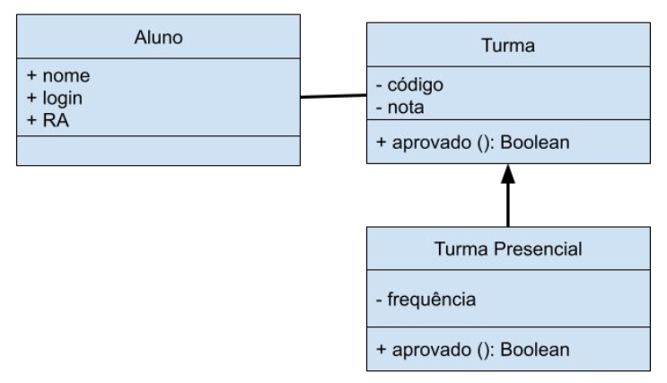

  <a href="#at01">Atividade 01</a>
  <a href="#at02">Atividade 02</a>
  <a href="#at03">Atividade 03</a>
  <a href="#at04">Atividade 04</a>

<h2 id="at01" style="font-weight: bold;">Atividade 01</h2>

1. Gere um projeto Node.js com o comando npm init.
2. Implemente as classes conforme o diagrama apresentado
3. Utilize módulos para organizar suas classes em um projeto Node.js

<h2 id="at02" style="font-weight: bold;">Atividade 02</h2>

<h3 style="font-weight: bold;">1. Descrição do Problema</h3>

Imagine que você está desenvolvendo um sistema de reserva de viagens online. Este sistema possui várias partes complexas, como reserva de voos, reserva de hotéis e aluguel de carros. Cada uma dessas partes possui sua própria lógica e interações com serviços externos.

Para simplificar a interação do cliente com o sistema, você decidiu usar o padrão de design Facade. Sua tarefa é criar uma classe TravelFacade que irá fornecer uma interface simplificada para o cliente, encapsulando toda a complexidade do processo de reserva de viagens.

<h3 style="font-weight: bold;">Solução</h3>

1. Modele as diferentes partes do sistema de reserva de viagens (reserva de voos, reserva de hotéis, aluguel de carros, etc.).
2. Implemente as classes necessárias para cada uma dessas partes.
3. Crie a classe TravelFacade que irá encapsular a interação com todas as partes do sistema.
4. Teste o sistema, mostrando como um cliente pode usar a TravelFacade para fazer uma reserva de viagem completa de forma simples, sem precisar conhecer os detalhes internos do sistema.

<h3 style="font-weight: bold;">2. Crie um exemplo de modelagem que represente a diferença entre os padrões comportamentais State e Strategy (utilize UML)</h3>

